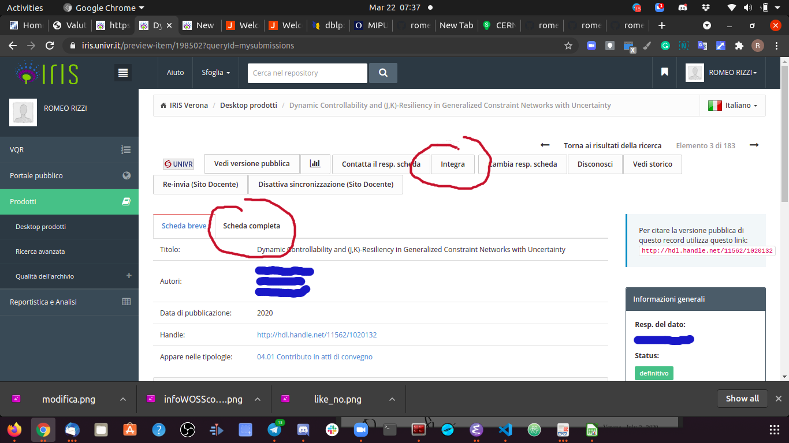
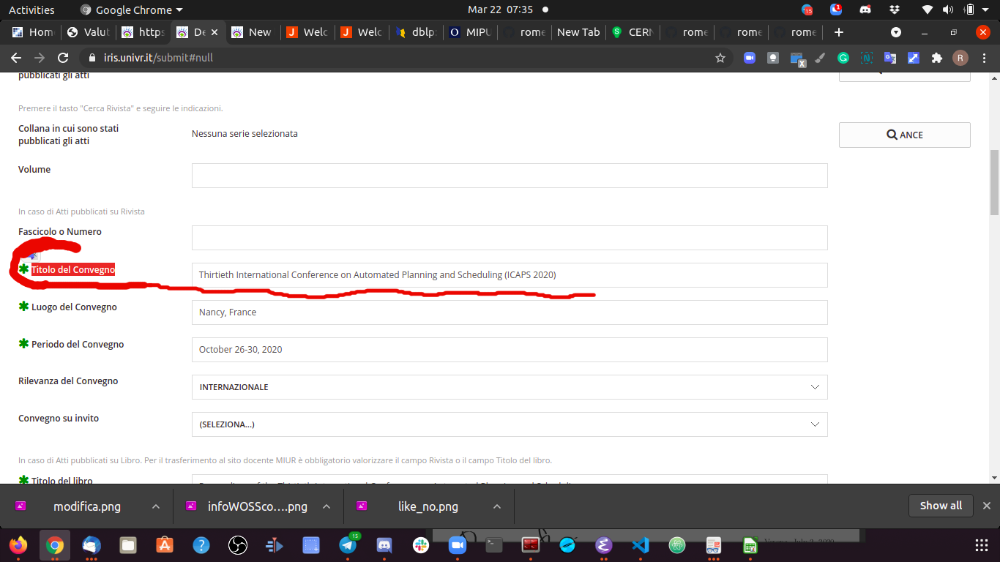

# VQR facile: come selezionare le proprie pubblicazioni

Conviene spezzare il lavoro in due fasi: cernita delle pubblicazioni da presentare e scelta ufficiale e definitiva delle stesse su `IRIS`. Questo documento si articola in due sezioni, una per ciascuna fase. Conviene partire dalla Fase 1 e con questa guida non è da escludersi ti venga possibile riuscire a sequenziarle in modo stretto.

Detto questo, nel cappello di questa prima sezione è solo giusto ringraziare le segretarie dei vari dipartimenti, a partire da quelle solerti del nostro che, ad esempio in particolare Aurora, si sono premunite di farci avere il file excel ed istruirci in merito anche su segnalazioni e richieste di colleghi docenti che anche hanno quindi contribuito alla raccolta di questo know-how.

Un modo concreto di dimostrare il nostro apprezzamento per il loro lavoro potrebbe essere quello di esaudire le loro richieste di aderire per spirito di collaborazione a dei workflow utili a garantire la miglior riuscita del processo stesso:

1. Per agevolarci il lavoro, Vi chiediamo di darci comunicazione dell'avvenuta chiusura della selezione.

2. Vi chiediamo inoltre di segnalarci se tra i prodotti da Voi selezionati ce ne sono alcuni che avete associato ad un SSD diverso dal vostro.


## Fase 1: individuazione e cernita 

In questa prima fase ti conviene avvalerti del supporto di due strumenti:

1. lo [strumento di supporto alla valutazione della CRUI](https://supportocrui.it/supportovalutazione/) che, sulla base delle pubblicazioni a te ricollegate da IRIS (a seguito di tue immissioni precedenti), ti aiuterà nel capire in quale categoria (A,B,C o D) esse possano ricadere.

2. lo strumento [Sherpa/romeo](https://v2.sherpa.ac.uk/romeo/), della famiglia degli [Sherpa](https://v2.sherpa.ac.uk/), ti consente di assicurarti di avere pieni diritti di mettere a disposizione su IRIS dei .pdf di tuoi lavori per i quali tu o tuoi coautori avete firmato i più svariati copyright.

Presenteremo i due strumenti separatamente, nelle due seguenti sezioni, ma a termine della seconda sezione cercheremo di suggerire come coordinare le interrogazioni ai due servizi in un workflow efficiente. Dedicheremo però un'ulteriore e terza sezione alla Fase 1, per discutere la corretta gestione di eventuali lavori a conferenza.

### Strumento di Supporto alla Valutazione della CRUI

Lo [strumento di supporto alla valutazione della CRUI](https://supportocrui.it/supportovalutazione/) si trova allo URL:

```
https://supportocrui.it/supportovalutazione/
```
1. Devi [entrare nello strumento](https://supportocrui.it/supportovalutazione/) con le tue credenziali. (Se non le hai o le hai dimenticate puoi sempre farle/rifarle lì per lì, come strutturato UniVR.)

2. Ti compare una tabella, di essa ti interessa solo cliccare sull'immagine () che si trova nella colonna "Prodotti", verso destra nella tabella.

Dopo aver cliccato scendi nella pagina che ti compare, dove trovi la tabella "Contributi in Rivista" o più sotto la tabella "Contributi in Atti di Convegni" (man mano che selezionerai i prodotti verrà a costituirsi una tabella "Prodotti Assegnati") al di sopra di queste due tabelle.  
Da queste due tabelle (se possibile dalla prima che ti sarà più semplice perché non dovrai rinominare le conferenze e non comporta valutazioni a valle) cerca le pubblicazioni adatte a questa VQR. Considera che le categorie A e B vanno entrambe bene (A è leggermente meglio di B, ma non vale la pena fare cambi di settore per aumentare da B ad A). Le C vanno messe solo se con le A/B non si arriva a 3 pubblicazioni. Metti la quarta pubblicazione solo se A/B.

Se puoi evita di mettere pubblicazioni dove hai coautori del tuo stesso ateneo perché se la stessa pubblicazione è messa da due o più coautori di ateneo sono tutte pallottole perse. Se è complicata accordati con loro tenendo anche conto del fatto che conviene dare la precedenza a docenti che siano stati promossi di ruolo nella finestra temporale di riferimento della VQR. (Per risolvere ogni dubbio in merito le segretarie del nostro dipartimento ci hanno fatto avere una lista dei docenti con il profilo "politiche di reclutamento", magari anche gli altri dipartimenti avranno saputo organizzasi in tale senso.) L'obiettivo è (dicunt) quello di massimizzare i punti per l'ateneo e non dovrebbe quindi avere alcun senso ragionare in ottica individuale.

Per alcuni di noi c'è il problema dei settori disciplinari. Ad esempio io quando sono entrato mi sono trovato un solo lavoro in A e tutto il resto era desolazione. Questo perché è ormai anni che raramente pubblico da solo o con coautori del mio settore (MAT/09) e nelle collaborazioni mi è giusto lasciare ai collaboratori scegliere la rivista o conferenza di sottomissione.

Come fare?

Bisogna rimappare i lavori su settori diversi dal proprio, dove essi raggiungono categoria A/B. Attenzione però perché ogni GEV ha proprie modalità di valutazione non note a priori e quindi se il settore è diverso dal proprio il GEV potrebbe mandare il lavoro in peer-review e l'effetto finale potrebbe essere del tutto deludente: la commissione potrebbe decidere che il valore/pertinenza del lavoro per quel settore sia discutibile. Delle varie rimappature possibili devi pertanto scegliere quei settori dove in effetti il lavoro risulterebbe di pertinenza piena. Resta comunque non piacevole sottostare ad una valutazione e giudizio ex-post e potrebbe essere inoltre opportuno porre dei paletti a priori su quali siano i settori nei quali potersi eventualmente avventurare ai fini della VQR. Prese a monte queste scelte la prima fase costa 15 minuti (per fare, dopo ore e aiuto di colleghi per capire cosa vada in ultima fatto).

Per selezionare una pubblicazione devi cliccare sulla  nella colonna "Preferenza". Lo farai una volta che la categoria della pubblicazione che trovi sulla stessa riga della tabella sia impostata ad A o B. Per modificare tale categoria richiedendo la valutazione di altro settore clicca sull'effige  contenuta nella colonna "Dettagli e Commenti". Quando clicchi su tale immagine vieni flashato su un'altra pagina dove devi scendere fino alla tabella titolata "Valutazione relativa ad Altre Aree/SSD" (ci arrivi diretto con ricerca (Ctrl-F su chrome) di "Altre"). Quì potrai selezionare un'altro settore cliccando nuovamente l'icona della . Puoi poi tornare alla pagina precedente utilizzando il pulsante apposito del browser, questo sito te lo lascia fare.  

Nella selezione dovrai tenere in considerazione anche il problema della messa a disposizione dei .pdf delle pubblicazioni che IRIS ti richiederà. Lo strumento di supporto a questo filtro di cernita è [Sherpa/romeo](https://v2.sherpa.ac.uk/romeo/), della famiglia degli [Sherpa](https://v2.sherpa.ac.uk/). Questo strumento è illustrato nella [sezione Sherpa Romeo](#sherpa-romeo). Il modo conveninte di organizzarsi per l'utilizzo contestuale di questi due strumenti è suggerito in fondo alla prossima sezione.
Consigliamo invece di separare nettamente le Fasi 1 e 2, ossia: prima seleziona i prodotti da presentare, procurati i .pdf (dove riesci) e controlla con Sherpa se puoi caricarli su IRIS. Eventualmente mettiti anche i max 4 `.pdf` in una cartella in locale mentre controlli di riuscire ad entrarne in possesso (magari riesci con VPN su Verona) oltre che di avere il diritto a caricarli su IRIS. Poi affronta IRIS e non avrai sorprese nè inciampi.


### Sherpa Romeo

Lo strumento [Sherpa/romeo](https://v2.sherpa.ac.uk/romeo/), della famiglia degli [Sherpa](https://v2.sherpa.ac.uk/), ti consente di assicurarti di avere pieni diritti di mettere a disposizione su IRIS dei .pdf di tuoi lavori per i quali tu o tuoi coautori avete firmato i più svariati copyright.

Come atterri sulla pagina ti basta riempire il campo "Journal Title or ISSN" e sottomettere per riuscire, magari dopo qualche tentativo per restringere in modo univoco il campo (io preferisco usare l'ISSN che trovo subito su `dblp`), ad arrivare ad una pagina che si rifrisca alla rivista in questione.

A dire il vero per una stessa rivista un lavoro può essere stato pubblicato secondo diverse possibili modalità previste dall'editore o variate negli anni. Per questo ti conviene assicurarti che mettere il .pdf su IRIS vada bene su tutti i pathway.

Selezionata una pathway (una alla volta, sic!), le autorizzazioni si trovano sotto "Location". Per caricare su IRIS vanno bene:

1. Open Access (in questo caso in IRIS si potrà mettere direttamente il link, non ti serve nemmeno scaricarti il .pdf, soluzione perfetta!)
2. Non-Commercial Repository
3. Institutional Repository


<strong>Hint 1:</strong> La cosa conveniente da fare quando si consulta "Sherpa Romeo" in concomitanza con lo "strumento di supporto alla valutazione della CRUI" è di farsi una lista parziale (fino al reperimento di un numero sufficiente di pubblicazioni) delle riviste che vanno bene per IRIS (senza nessuna pretesa che qusta lista possa valere in anni futuri).

<strong>Hint 2:</strong> Non cliccare sui pathways per visionarli (altrimenti poi quando torni indietro devi rifare ogni volta il percorso). Clicca invece sul `+` che trovi a destra ed esso si espanderà esibendo le info che ti servono, per poi ricollassare quando premi `-`.

### Lavori a Conferenza

Una cosa importante da sapere è che per far riconoscere a SupportoCrui (e non escludiamo anche quella della commissione che valuterà) la corretta classificazione dei Convegni/conferenze è necessario che il campo "Nome del convegno" (anche chiamato "Titolo del Convegno" in altri contesti) in IRIS coincida esattamente con il titolo nella colonna "title" della tabella excel che trovi nella [cartella coi descrittori corretti di conferenze/convegni](conference_titles/).

 <strong>Purtroppo 1</strong>: Quando in IRIS si carica una pubblicazione a conferenza succede che la maggior parte delle conferenze non risultino correttamente classificate. A seguito di ciò la loro valutazione su SupportoCrui (e non escludiamo anche quella della commissione che valuterà) sarà pari a zero.
 Conviene pertanto effettuare la modifica del titolo in IRIS il prima possibile.
 La modifica sarà visibile su SupportoCrui il giorno successivo.

 Ad esempio:
  una conferenza indicata in IRIS con titolo "42nd Annual ACM SIGPLAN-SIGACT Symposium on Principles of Programming Languages" non viene semplicemente classificata. La stessa deve essere indicata con il titolo "ACM SIGPLAN-SIGACT SYMPOSIUM ON PRINCIPLES OF PROGRAMMING LANGUAGES", dove risulta classificata A++.

 <strong>Purtroppo 2</strong>: Devi scegliere la tabella excel relativa alla tua disciplina. E non è detto che ne troverai una copia già collocata in questo repo. Dato che l'obiettivo da raggiungere con la VQR è di ateneo, conviene ci organizziamo in modo distribuito in questo: inviatemi tabelle aggiuntive al mio indirizzo istituzionale UniVR di posta elettronica AND/OR organizzatevi a livello di dipartimento.

Dopo essere entrato in IRIS, i passi per correggere i titoli delle conferenze per quei singoli lavori che avrai deciso di valorizzare per questa VQR sono i seguenti:

1. Arrivare alla seguente schermata dove puoi sia chiedere di visualizzare (per più rapidamente controllare) pigiando sul tag/tab di "Scheda_Completa" che avviare l'editing di correzione pigiando il bottone "Integra"

2. Quando visualizzi la scheda completa il campo cui guardare si chiama "<strong>Nome</strong> del Convegno"

3. Quando invece integri, il dato da editare è nel secondo dei form di immissione dati che ti vengono scarrellati, e quì si chiama "<strong>Titolo</strong> del Convegno"

I seguenti Screenshots potranno aiutare a risolvere i tuoi dubbi se sei un caccadubbi come il sottoscritto:

<details><summary>Visualizza uno screenshot guida il bottone "Integra" e il tag/tab "Scheda Completa"</summary> 

<a href="url"></a>

</details>

<details><summary>Visualizza uno screenshot guida per "Scheda Completa"</summary> 

<a href="url"></a>

</details>

<details><summary>Visualizza uno screenshot guida sul campo "<strong>Titolo</strong> del Convegno" da correggere</summary> 

<a href="url"></a>

</details>

Una volta fatto tutto questo, ed atteso il giorno dopo se l'operazione di correzione si è rivelata necessaria, puoi proseguire come segue:

*** DA SISTEMARE ***
Anocora una volta per selezionare una pubblicazione devi cliccare sulla  nella colonna "Preferenza". Ma questa Lo farai una volta che la categoria della pubblicazione che trovi sulla stessa riga della tabella sia impostata sulle categorie utili (un Vant (vedere utima colonna) superiore a 5 dovrebbe essere più che sufficinte). Per modificare tale categoria richiedendo la valutazione di altro settore clicca sull'effige  contenuta nella colonna "Dettagli e Commenti". Quando clicchi su tale immagine vieni flashato su un'altra pagina dove devi scendere fino alla tabella titolata "Valutazione relativa ad Altre Aree/SSD" (ci arrivi diretto con ricerca (Ctrl-F su chrome) di "Altre"). Quì potrai selezionare un'altro settore cliccando nuovamente l'icona della . Puoi poi tornare alla pagina precedente utilizzando il pulsante apposito del browser, questo sito te lo lascia fare.  


Vai alla tabella in fondo alla pagina titolata "Dettagli Selezione Prodotto". CLicca su 


## Fase 2: scelta ([IRIS](https://iris.univr.it/))

Il portale dove avviene la vera e definitiva selezione dei tuoi prodotti di ricerca è [IRIS](https://iris.univr.it/). Lo trovi allo URL:

```
https://iris.univr.it/
```

Ecco l'iter da seguire una volta entrato:

1. VQR
2. seleziona pubblicazioni
3. campagna VQR  15/19
operazioni > modifica
obbligatorio accettare (non si può procedere senza) 
salva e successiva (si passa automaticamente dal tab dati generali a selezione pubblicazioni)

bottone "Cerca" in basso a destra

dopo aver schiacciato il bottone scendere più sotto


Fatto! (Time: 5 minuti (sempre a sapere cosa bisogna fare) )

